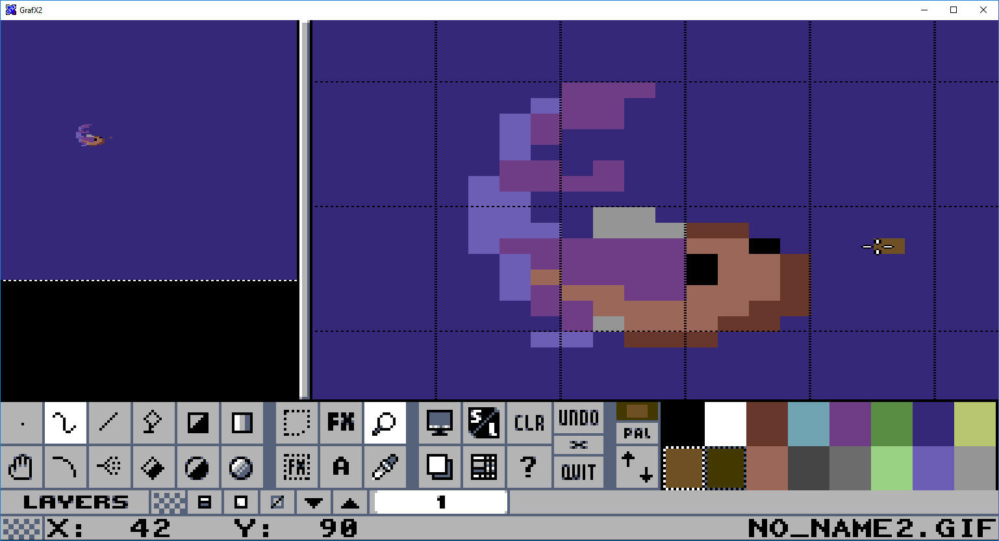
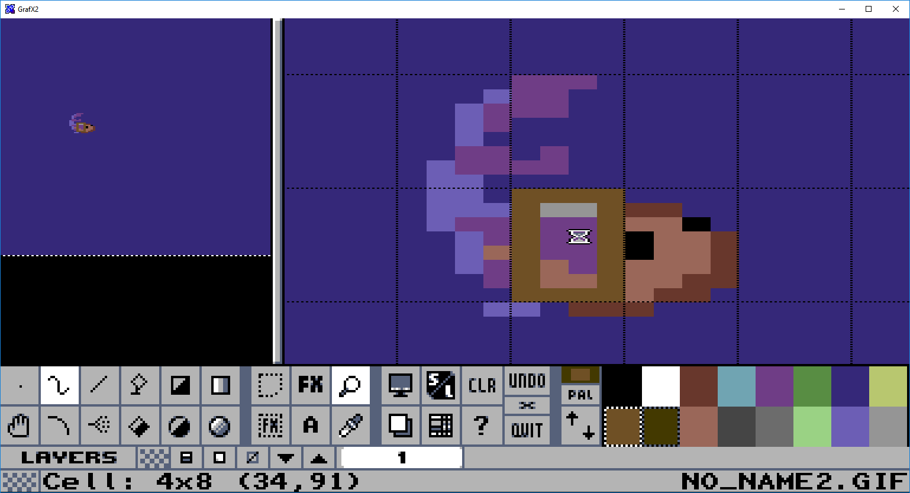
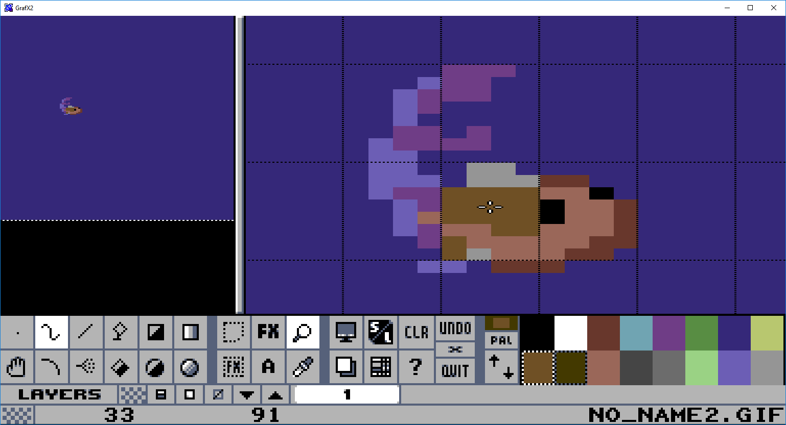

# grafx2-c64tools
C64 graphics plugins for GrafX2 by Vent/Extend

## Introduction
These Lua scripts are written to be used with GrafX2 2.4 or later as 'Brush Factory' plugins.

Scrips are written to my own use as helpers for cross-platform C64 graphics drawing, so beware of peculiarities. 

For a great cross-platform C64 graphics editor with a brilliant out-of-box user experience, check out [Multipaint](https://multipaint.kameli.net) by Dr.TerrorZ.

GrafX2 is a drawing tool originally created by Sunset Designs. You can get it [here](http://grafx2.chez.com/index.php?static3/downloads).

There are currently 3 plugins available:

* Cell Color Check - checks if there are color clashes in the picture
* Cell Filler - fill tool that replaces the selected color in a character block
* Palette Toggler - toggles between different palettes created to mimic the colors of a PAL C64

## Installation
1. Locate your GrafX2 share directory (usually 'share/grafx2' under your GrafX2 installation directory).
2. In that directory, ```git clone https://github.com/ventti/grafx2-c64tools.git```.
3. Start GrafX2. Select 'Brush Effects/Factory' with right-mouse-button.
4. Follow the installation guide under each script.

# Cell Color Check
This is a tool for checking color clashes in a picture. 
The tool indicates the cells with color clashes by drawing a square over the particular cell (character block).
The color of the generated square indicates how many colors there are in the block. 
Cell with 5 colors is indicated with color number #5 in the palette, 6 colors with #6, etc.

## Usage
Initiate the script with the keyboard shortcut.

Adjustable parameters:

* Cell width
   Cell or character block width in pixels. 
* Cell height
   Cell or character block height in pixels.
* Colors in a cell
   Number of individual colors within a single cell/character block sized by (Cell width x Cell height).
* Use a common bgcolor
   If selected, one of the colors shall be same for each cell.
* Common background color
   The value of common bgcolor. Order numbers 0..15 are colors in the current palette. 
   If -1 is selected, the script will determine the background color resulting with the least number of cells having clashes.
* Show vacant cells
   If selected, not only cells with clashes are shown. Also cells with less colors than maximum allowed are marked.
* Save preferences to a metafile 'your_picture_name.ext_config.ini' in the picture folder.

Block size and colours are initially guessed by picture dimensions as follows:

| Mode                      | X dimension | Y dimension | Default block size | Number of colors | Common background color |
| ------------------------- |:-----------:|:-----------:|:------------------:|:----------------:|:-----------------------:|
| Hires		                | 320         | 200         | 8x8                | 2                | No                      |
| Multicolor                | 160         | 200         | 4x8                | 4                | Yes                     |
| Multicolor with borders   | 192         | 272         | 4x8                | 4                | Yes                     |
| Quarter-character PETSCII | 80          | 50          | 2x2                | 2                | Yes                     |
Multicolor with borders -mode omits clashes in the borders. Character block grid origo (x0,y0) = 16,34 (as wide pixels. 32,34 as square pixels)

## Installation
Precondition: The generic installation procedure has been successfully completed.
Select __CellColorCheck.lua__ in the file menu. Assign a keyboard shortcut e.g. __Alt__+__F1__.

## Pro tips
* You can sketch up your drawing rather freely and later optimize the palette. Just let the script determine, which background color causes least issues with your content.
* Before running the script, select the background color manually. The script pre-selects that value by default.
* Before running the script, create a new layer with __Alt__+__Ins__. 
  The script draws the clash indicator squares on the currently selected layer.
  It is then easy to fix the picture by showing/hiding the layer with the indicators.
* The script does not take the actual palette into account. You can use the script for other platforms as well, e.g. MSX and Screen 2.
* Save preferences to speed up the clash checking. If you want to re-adjust the saved preferences, just modify the corresponding .ini file with a text editor or delete it to show the GUI.

# Cell Filler
This is a tool for quickly replacing a color with another in a character block. Block size is guessed by picture dimensions.
If image width is 160px, 4x8px block (C64 multicolor) will be used. Otherwise block size is 8x8px.

## Installation
Precondition: The generic installation procedure has been successfully completed.

Select __CellFiller.lua__ in the file menu. Assign a keyboard shortcut e.g. __Ctrl__+__'F'__.

## Example







# Palette Toggler
This is a tool for toggling and previewing a picture with different C64 palettes. 

This approach is chosen as it is challenging to define exact 'optimal' RGB values due to several sources of uncertainity (e.g. the C64 model, chosen output port, cable, monitor, monitor settings, personal preferences etc.)

__WARNING__: The script modifies the palette of the image. Undo can be used, but bear in mind the limitations of the undo buffer.

## Installation
Precondition: The generic installation procedure has been successfully completed.

Select __PaletteToggler.lua__ in the file menu. Assign a keyboard shortcut e.g. __Alt__+__'F2'__.

## Usage
The following keyboard shortcuts and mouse actions are supported:

* __F1__ - online help. Shows commands and available palettes.
* __0__ - __9__, __a__ - __e__ - select a certain palette
* __ESC__ or __Right Mouse Button__ - exit script.
* __SPACE__ or __Left Mouse Button__ - browse palettes  

See status message for the name of the current palette.

## Pro tips

* Estimate how would the picture look like with a real machine or different emulators by toggling different palettes. Consequently a good color balance can be achieved.
* Changing the palette during the drawing process may give new points of view to the work in progress

# Remarks
Great RGB palette approximations to mimic PAL C64 colors ([Pepto](https://www.pepto.de/projects/colorvic/2001/)) and signal path ([Colorode](https://www.colorode.com/)) exist.

One cannot either neglect the PAL signal features and C64-specific artefacts (http://hitmen.c02.at/temp/palstuff/).

## Known issues
Clicking mouse buttons during the script may cause the selected drawing tool to operate on the background, if mouse cursor is over the picture.

## Acknowledgements
This project began by modifying Paulo Silva's example script.
Brush Script documentation at [GrafX2 User Guide](http://pulkomandy.tk/projects/GrafX2/wiki/UserGuide/Lua)

## Disclaimer
No copyright, do whatever you want. It's just a few lines of bad code anybody could write. 

No warranty, either. It may work, or it may not. It may blow up your computer, or it may not.
